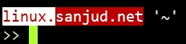
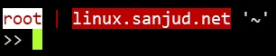

Add below lines in your profile file .bashrc to customized and colorize your prompt.
\
\
\
In this bash prompt *linux* is a hostname and *sanjud.net* is the domain name and last is the current working directory.\
+++++++++++++++++++++++++++++++++++++++++++++++++++\
``DN=`hostname -d`;if [ -z $DN ];then HN=`hostname -s`;elif [ -n $DN ];then HN=`hostname -s`.;fi``
``PS1="\n\e[107;31m$HN\e[0m\e[1;37;41m$DN\e[0m '\w'\n>> "``\
+++++++++++++++++++++++++++++++++++++++++++++++++++
\
\
\
\
In this bash prompt *root* is the user followed by separator pipe | *linux.sanjud.net* is the FQDN and last is the current working directory.\
+++++++++++++++++++++++++++++++++++++++++++++++++++\
`PS1="\n\e[107;31m\u\e[0m\e[31m | \e[0m\e[1;37;41m\H\e[0m '\w'\n>> "`\
++++++++++++++++++++++++++++++++++++++++++++++++++
